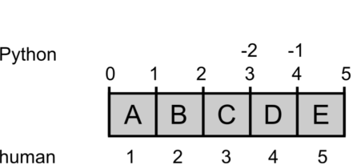

# Indexing and Slicing

**Computers and people count differently:**



Computers treat an address in memory as the *starting point* of a body of data. In the same sense, an *index* in Python always refers to such a starting point, something that is *in between* two objects in memory. We humans in contrast always count the objects themselves.

This is why the indices used to slice lists are a bit unintuitive at first, e.g. in:


```python
s = "my fat cat"
```


```python
s[3:6]
```


    'fat'


```python
'fat'
```


    'fat'


The diagram provides a practical model by which you can deduce indices yourself.

## Indexing

Many data types (lists, strings) allow to index items by their position:


```python
    s = 'my fat cat'
```


```python
    s[0]  # first
```


    'm'


```python
    s[2]  # third
```


    ' '


```python
    s[-1] # last
```


    't'


Using and index that does not exist causes an `IndexError`.

## Slicing

We can define intervals. This is called **slicing**:
    


```python
    
    s = 'my fat cat'
    s
```


    'my fat cat'


```python
    s[3:6]  # -> 'fat'
```


    'fat'


Slices may be open on either side:

    


```python
    s[3:]  # -> 'fat cat'
    
```


    'fat cat'


```python
s[:6]  # -> 'my fat'
```


    'my fat'


If you leave both number out, you copy the variable. This is sometimes a neat trick, if you want to manipulate a list, but preserve the original.


```python
    d = [1, 2, 3]
    d
```


    [1, 2, 3]


```python
    e = d[:]
    e
    
```


    [1, 2, 3]


```python
    d.append(4)
    d
    
```


    [1, 2, 3, 4]


```python
    len(d)  # is now 4
```


    4


```python
    len(e)  # still 3
```


    3


You can define slices with a step size:

    


```python
    s = 'my fat cat'
    s
    
```


    'my fat cat'


```python
    s[1:8:2]  # -> 'yftc'    
```


    'yftc'


```python
    s[:8:2]   # -> 'm a '
```


    'm a '


```python
    s[1::2]   # -> 'yftct'
```


    'yftct'


The step size may even be negative:

    


```python
    s = 'my fat cat'
    s
    
```


    'my fat cat'


```python
    s[::-1]  # -> 'tac taf ym'
```


    'tac taf ym'


