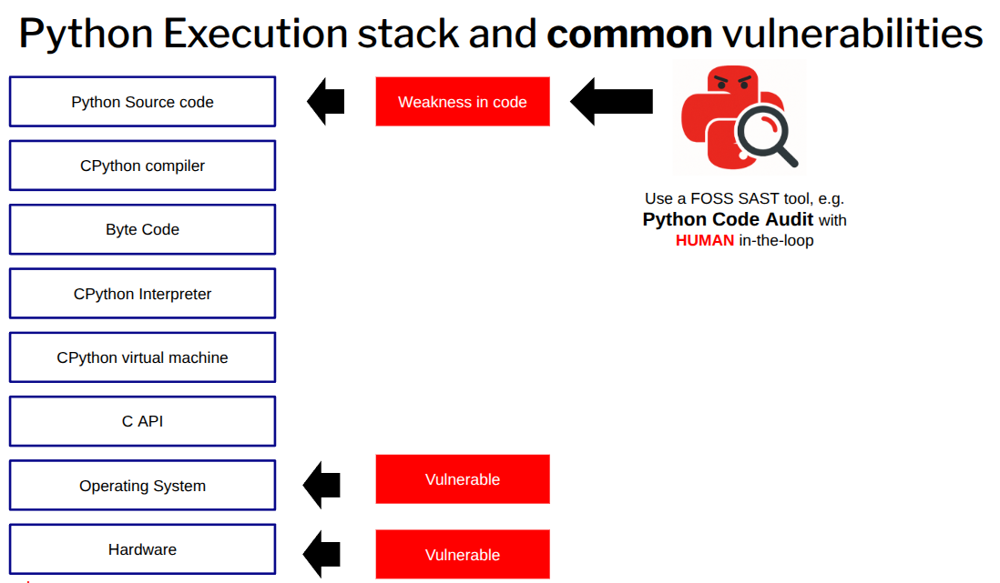

# Python Attack Landscape

Python's popularity, ease of use, and widespread adoption make it an attractive target for malicious actors. It is commonly pre-installed or readily available on developer workstations, servers, and cloud environments, giving attackers an easily accessible tool for misuse.

Python itself does not implement **privilege separation** within the interpreter to limit the attack surface when executing code. Once an attacker gains the ability to run arbitrary Python code, they inherit the full privileges of the process running the interpreter — typically those of the user account executing the program. This often grants broad access to the filesystem, network, environment variables, and other system resources.

While true privilege separation cannot be reliably enforced *inside* Python (due to the large attack surface of the interpreter), it can be applied externally by running Python code within a sandboxed environment (e.g., using containers, seccomp filters, virtual machines, or tools like GraalVM isolates). However, no sandbox is 100% secure — escapes and bypasses remain possible, as demonstrated in various real-world vulnerabilities.

Vulnerabilities in Python programs are commonly exposed through:

- **Untrusted or malicious input**  
  Attackers can supply malicious data via APIs, corrupted files, or insufficiently sanitised user input. Examples include malformed XML/JSON/YAML triggering parser bugs, poisoned data files, or insecure REST endpoints lacking proper validation and security controls.

- **Insecure third-party modules**  
  Dependencies from PyPI or other sources may contain vulnerabilities, supply-chain compromises, or malicious code.

A particularly significant risk is Python's ability to **execute arbitrary code provided as data**. This capability underpins many injection and remote code execution (RCE) attacks, such as unsafe deserialisation (e.g., via the `pickle` module), `eval()`/`exec()` misuse, or dynamic code loading from untrusted sources.

## Security Vulnerabilities Specific to Python Software

Beyond general environmental risks during execution, certain threat vectors are inherent to Python applications and often stem from gaps in the **Software Development Life Cycle (SDLC)**:

- **Lack of security auditing**  
  Many Python codebases receive little or no internal security auditing, static/dynamic analysis, or architectural/design reviews tailored to the target environment. As a result, vulnerabilities can persist undetected from development through to production for years.

- **Insufficient security awareness**  
  A significant number of Python developers lack formal training in secure coding practices. This leads to the introduction of common weaknesses. Modern AI-assisted coding tools can exacerbate the issue by generating code riddled with security flaws that readily become exploitable vulnerabilities.

- **Unreviewed code**  
  Substantial portions of Python code — across development, staging, and production — undergo no security-focused peer review. Static Application Security Testing (SAST) is rarely performed comprehensively; when it is, coverage is often limited to only a minimal set of issues.

- **Over-privileged accounts and processes**  
  Developers, testers, CI/CD pipelines, and automated processes frequently operate with excessively broad permissions. Upon compromise, attackers can exploit these elevated privileges for lateral movement, data exfiltration, persistence, or full system takeover.

The combination of Python's powerful dynamic execution features and longstanding systemic weaknesses in development practices — such as minimal code review, inadequate dependency management, and reliance on over-privileged accounts — creates a particularly fertile environment for compromise.

:::{tip} 
Many Python code weaknesses are detected in the #1 **Open Source** Python SAST tool, [**Python Code Audit**](https://nocomplexity.com/codeaudit/)
:::