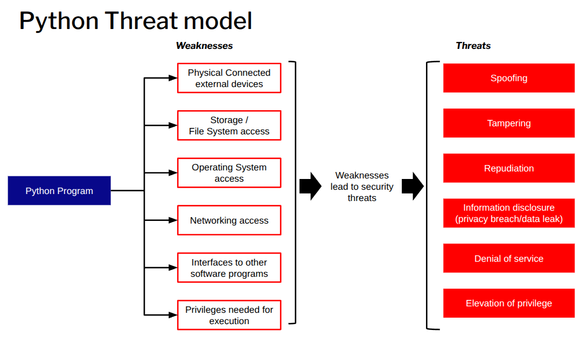

# Python Threat Model

Threat modelling is the process of identifying and analysing potential security threats and vulnerabilities in a system, application, or network.

To mitigate potential security risks with a balanced budget, security threat modelling is critical. 

Python is an interpreted general-purpose computer language. Using Python programs or creating Python software in a secure way requires insight into all potential security threats.

## Scope

Every high-quality threat model starts with a clearly defined scope.

This helps establish a clean separation between **Python-specific security threats** (those tied to the language, its standard library, or common Python idioms) and **general threats** (those that could affect software regardless of implementation language).

**In Scope**:  
This threat model covers **a software program written in Python**.  

The Python program may provide functionality in one or both of the following ways:  
- indirectly, by offering reusable components to other Python programs (as a **module**, **library**, **framework**, or similar), or  
- directly, by delivering end-user functionality (CLI tool, GUI application, web service, script, etc.).

This scope intentionally excludes:
- non-Python components or ecosystems (C extensions are considered only to the extent that they interact with the Python layer in a security-relevant way).

**Out of scope**: 
- The Python interpreter
Most commonly this refers to the CPython binary (the reference implementation written in C). However, alternative implementations exist, such as PyPy, RustPython, Cinder, GraalPython, and others.
Security threats that affect the Python interpreter itself are fundamentally different from those that target individual Python programs or libraries. This threat model deliberately excludes attacks against the interpreter binary, its C-level code, JIT compiler (in PyPy), memory management, or parser. Such issues belong to a separate class of vulnerabilities (often memory-safety bugs, deserialisation gadgets in marshal/pickle, or interpreter-level sandbox escapes).

+++

- Operating system, container, and hardware-level threats
The attack surface at the operating-system level, within containers/virtual machines, or at the hardware/firmware layer is extremely broad. Once an attacker has compromised the OS, container runtime, kernel, hypervisor, or underlying hardware, they can typically modify arbitrary code, memory, configuration files, environment variables, and process state — rendering almost any application-level security control moot.

:::{important} 
Our threat model focuses exclusively on preventing a malicious or vulnerable Python program from being used to compromise the broader system, the host operating system, neighbouring processes, persistent storage, network resources, or other security boundaries.
In other words, the scope is “Python → system” rather than “system → Python”.
:::

Below the core high level Python Treat model:

## STRIDE Threat Model

The following table summarizes the classic **STRIDE** threat categories, with precise definitions using consistent British English phrasing suitable for security documentation.

| **Threat**                 | **Threat Definition**                                                                              |
|----------------------------|----------------------------------------------------------------------------------------------------|
| **Spoofing**               | Pretending to be something or someone other than oneself                                           |
| **Tampering**              | Unauthorised modification of data on disk, in network transit, in memory, or in other locations    |
| **Repudiation**            | Denying responsibility for an action or event (whether the claim is true or false)                 |
| **Information Disclosure** | Unauthorised access to or exposure of sensitive or confidential information                        |
| **Denial of Service**      | Making a service unavailable by exhausting or depleting required resources                         |
| **Elevation of Privilege** | Gaining higher access rights or permissions than originally authorised                             |

:::{note} 
- This table is commonly used as the foundation for threat modelling of Python applications, libraries, frameworks, and tools.
- When applying STRIDE to Python code, consider both **application-level** threats and **Python-runtime-specific** nuances (e.g. module spoofing via `sys.path`, pickle deserialisation for tampering, etc.).
- STRIDE is a mature threat-modeling method that is used at large worldwide. For more information check [Open Security Reference Architecture](https://nocomplexity.com/documents/securityarchitecture/introduction.html).
:::

## Common Python threats 

Some common threats for a Python program are:

### Spoofing

Spoofing occurs when an entity pretends to be something or someone else, undermining authentication controls. In the context of Python programs, the following are common spoofing threats:

- **Module or library spoofing**  
  Untrusted code can exploit Python's flexible import system (e.g. via manipulated `sys.path`, current working directory imports, or namespace conflicts) to load malicious modules instead of legitimate ones.

- **Malicious program creation / arbitrary file write**  
  Malicious Python code, when executed with excessive privileges, can create or overwrite files in unintended locations (e.g. configuration files, startup scripts, or system binaries), effectively "spoofing" legitimate software behaviour or persistence mechanisms.

- **Function or class spoofing (monkey-patching)**  
  Leveraging Python's dynamic nature, malicious code can override ("monkey-patch") legitimate functions, classes, or methods at runtime, altering expected behaviour without modifying source files.

- **Username or user ID spoofing**  
  If a Python program runs with elevated privileges, untrusted input or vulnerable code could allow an attacker to impersonate another user or process on the system (e.g. forging credentials, session tokens, or process attributes).

- **Path spoofing ([path traversal / directory traversal](traversalattacks))**  
  Python code can use path traversal sequences (e.g. `../`, absolute paths, or encoded variants) to access or modify files outside the intended directory. This often enables reading sensitive system files (e.g. `/etc/passwd`, `/proc/self/environ`) or executing hidden malicious scripts. The risk is greatly increased when the program runs with overly broad privileges.

- **Network spoofing**  
  When running with elevated privileges, malicious Python code could forge network identities, modify traffic, or issue commands that impersonate trusted entities (e.g. via ARP/DNS poisoning helpers, forged packets, or session hijacking). This is particularly severe for applications that handle sensitive data or perform privileged network operations.

### Tampering

Tampering involves the unauthorised modification of data, code, or program behaviour. In the context of Python programs, the following tampering threats are particularly relevant:

- **Code tampering**  
  Malicious Python code can modify source files (`.py`) or compiled bytecode files (`.pyc`, `.pyo`) on the filesystem, altering the program's future behaviour or injecting persistent malicious changes.

- **Memory tampering**  
  During execution, Python code can directly modify values in memory (e.g. via `ctypes`, `mmap`, object attribute manipulation, or unsafe use of libraries such as `numpy` or `array`). This can change variable contents, bypass authentication logic, alter control flow, or patch functions without touching files on disk.

- **Dependency hijacking**  
  When executed with excessive privileges, a malicious Python program can overwrite or replace legitimate library files (in site-packages, virtual environments, or system Python directories) with malicious versions, affecting all future imports of that library.

- **Filesystem tampering**  
  Python programs can create, modify, delete, or rename files and directories arbitrarily if granted sufficient permissions, potentially corrupting application data, configuration files, or system resources.

- **Symlink and hardlink attacks**  
  A Python program can create symbolic links (symlinks) or hard links pointing to sensitive system files. If the program later writes to what it believes is a benign application file but is actually a symlink to `/etc/shadow`, `/var/log/auth.log`, or similar, it can unintentionally (or maliciously) modify critical system files.

- **Log tampering**  
  With appropriate permissions, malicious Python code can truncate, overwrite, delete, or selectively modify log files to conceal evidence of malicious activity (e.g. removing entries related to unauthorised access or command execution).

- **Arbitrary file read/write**  
  Frequently caused by insufficient input validation or sanitisation (e.g. in file paths, filenames, or configuration loading logic), allowing an attacker to read from or write to arbitrary locations on the filesystem, including sensitive files outside the intended working directory.

### Repudiation

Repudiation occurs when an actor can deny having performed an action (or when there is insufficient evidence to prove responsibility). In Python programs, repudiation threats often stem from the lack of reliable audit trails or from actions that deliberately obscure accountability:

- **Lack of privilege separation / user-context execution**  
  Python programs typically run with the same privileges as the user who launched them. This allows malicious code to perform sensitive actions (e.g. modifying configuration files, sending emails, or making API calls) in a way that appears to originate from the legitimate user, making it difficult to later prove malicious intent.

- **Log deletion or modification**  
  With sufficient permissions, a Python program can delete, truncate, overwrite, or selectively alter log files (application logs, system logs, audit trails), removing evidence of malicious activity and enabling plausible deniability.

- **Command injection (leading to repudiation)**  
  If a Python program is vulnerable to command injection (e.g. via `os.system()`, `subprocess` without proper shell escaping, or unsafe string interpolation), an attacker can execute arbitrary commands. Because these commands run under the program's process identity, they are often indistinguishable from legitimate actions performed by the user, complicating attribution.

- **Undetected log tampering as a repudiation vector**  
  When log tampering succeeds, malicious actions can go completely unnoticed or be plausibly denied, as there is no reliable, tamper-evident record remaining to demonstrate that an unauthorised change or operation occurred.

### Information Disclosure

Information disclosure (also known as a privacy breach or data leak) occurs when sensitive, confidential, or personally identifiable information is exposed to unauthorised parties. In the context of Python programs, the following are common vectors for information disclosure:

- **Misconfigured debugging or logging**  
  Enabling debug mode in production (e.g. `app.debug = True` in Flask, `DEBUG=True` in Django settings) or excessively verbose logging can expose stack traces, environment variables, internal paths, request/response bodies, or sensitive configuration details.

- **Secrets hardcoded in code or configuration files**  
  API keys, passwords, private keys, tokens, or database credentials stored directly in source code (`.py` files), configuration files (`.env`, `config.py`, `settings.py`), or version-controlled repositories can be accidentally exposed through source-code leaks, backups, or misconfigured deployments.

- **Directory listing or unintended file enumeration**  
  Web applications or file-serving scripts that do not disable directory indexing (or that implement unsafe path handling) may allow attackers to list directory contents, revealing file names, structure, or hidden resources (e.g. backup files ending in `.bak`, `.old`, or `.pyc`).

- **Insecure data handling in memory**  
  Sensitive data (passwords, tokens, PII) stored in plain text in memory for extended periods, copied unnecessarily, or not securely wiped (e.g. using `del`, `zero-out` patterns, or libraries such as `secrets`) can be extracted via memory dumps, core files, debugging tools, or side-channel attacks.

- **Missing or incorrectly implemented encryption**  
  Failure to encrypt sensitive data at rest (e.g. in databases or files) or in transit (e.g. missing TLS, weak ciphers, or improper certificate validation) exposes data to interception, eavesdropping, or unauthorised access on disk, network, or backups.

- **Transmission of confidential data to external systems via APIs**  
  Python programs that send sensitive information (e.g. user data, credentials, health records) to third-party APIs over unencrypted channels, or without proper consent/validation, can inadvertently leak data to unintended recipients or intermediaries.

- **Confidential data exposed in log files or stack traces**  
  Logging of sensitive information such as passwords, session tokens, credit card numbers, personal details, or full HTTP requests/responses (including headers and bodies) into application logs, error reports, or exception stack traces can lead to exposure if logs are accessible to unauthorised users, stored insecurely, or shipped to external logging services without redaction.

### Denial of Service

A malicious Python program can cause denial-of-service (DoS) conditions in several ways:

- **Resource exhaustion**  
  It can consume excessive CPU, memory, or I/O bandwidth (to disk, network, etc.), preventing other processes from running normally.

- **Network-based attacks**  
  A malicious Python program can perform or trigger various types of network-based denial-of-service attacks.

- **ZIP bomb / decompression bomb attacks**  
  It can create or transmit a so-called "ZIP bomb" — a small compressed file that, when decompressed, expands into an extremely large amount of data, potentially consuming all available disk space and/or memory on the target system.

### Elevation of Privilege

A malicious Python program running with **elevated privileges** (more permissions than necessary) can cause severe damage in several ways:

- **System manipulation and control**  
  It can modify, delete, or corrupt critical system files, configuration files, or user data across the entire system.

- **Access to and theft of sensitive data**  
  With excessive privileges, the program can read files and data it would otherwise be denied access to, enabling the theft of credentials, personal information, financial data, or other confidential material.

- **Lateral movement / network attacks**  
  A Python program running with elevated privileges can serve as a beachhead to launch attacks against other systems on the same network, for example by exploiting vulnerable network protocols or using stolen credentials to pivot to additional hosts.

- **Data destruction and ransomware**  
  The program can permanently delete files or entire drives, or encrypt user and system files (as in a ransomware attack), rendering data inaccessible and potentially demanding payment for decryption keys.

### Typical Threat Actors for Python

In a generic threat model for Python (including the language runtime, standard library, ecosystem, and applications written in Python), the following personas are commonly considered:

- **Python developer**  
  An individual or team writing, maintaining, or extending Python code (applications, libraries, scripts, etc.). They have legitimate access to code and may introduce vulnerabilities through mistakes, insecure patterns, or supply-chain compromises.

- **System administrator**  
  A person responsible for deploying, configuring, and running Python programs in production or development environments. They control execution context, permissions, dependencies, and environment variables, which can influence security boundaries.

- **CPython developer / contributor**  
  Someone contributing code, bug fixes, or features to the CPython interpreter (the reference implementation of Python). Their changes can affect core language behaviour, performance, or security mechanisms.

- **Core Python maintainer (PSF-appointed)**  
  A trusted maintainer with commit access to the official CPython repository, appointed or recognised by the Python Software Foundation (PSF). They have significant influence over what becomes part of the official Python distribution.

- **Malicious actor (adversary)**  
  A generic "bad actor" who intentionally seeks to exploit, compromise, or abuse Python code or the ecosystem (e.g. via malicious packages, supply-chain attacks, code injection, or social engineering).  
  *Note: In this high-level/generic threat model, we do not further break down specific subtypes of malicious actors (e.g. script kiddies, organised crime, nation-state, insider threats).*

- **End user of a Python program**  
  A person or automated process that runs or interacts with a Python-based application/script. They may supply untrusted input, install packages, or execute code in ways that trigger vulnerabilities.

- **Integrating process or application**  
  Another system, service, or application that consumes or interacts with a Python program (e.g. via APIs, command-line invocation, shared files, data pipelines, or inter-process communication). These can introduce risks through unsafe data exchange or privilege escalation paths.

## Create Your Own Python Threat Model

Using our general Python threat model as a foundation makes it much easier to create a tailored threat model specific to your own use case. 

Follow these steps to develop one:

1. **Apply the STRIDE model**  
   Systematically identify potential threats by categorising them according to the STRIDE framework (developed by Microsoft):  
   - **Spoofing** — impersonation of users, processes, or systems  
   - **Tampering** — unauthorised modification of data or code  
   - **Repudiation** — denial of actions or events  
   - **Information disclosure** — unauthorised access to sensitive data  
   - **Denial of service** — disruption of availability or performance  
   - **Elevation of privilege** — gaining unauthorised higher-level access  

   Map these threat categories to the components, data flows, trust boundaries, and actors in your Python-based system.

2. **Define the scope and context**  
   Clearly determine the boundaries of the Python software to which your threat model applies. Consider:  
   - The specific application, library, script, or deployment (e.g., a web service, CLI tool, data pipeline, or embedded script).  
   - The environment (development, production, cloud, on-premises, containerised, etc.).  
   - Key assets (data, code, credentials, configuration).  
   - External dependencies (third-party packages, CPython interpreter version, OS interactions).  
   - Relevant actors (developers, end users, administrators, adversaries).  
   Document assumptions, out-of-scope items, and any known constraints.

3. **Discuss, refine, and evaluate the threat model**  
   Collaborate with relevant stakeholders (developers, security team, operations) to:  
   - Review identified threats for completeness and relevance.  
   - Assess likelihood, impact, and risk severity (e.g., using qualitative scales like Low/Medium/High).  
   - Prioritise threats and propose mitigations or controls (e.g., input validation, least privilege, dependency pinning, secure coding practices).  
   - Validate assumptions and update the model as the system evolves.  
   - Iterate periodically or after significant changes (new features, dependencies, deployments).  

By following this structured approach, you can produce a practical, actionable threat model that aligns security efforts with your particular Python project.